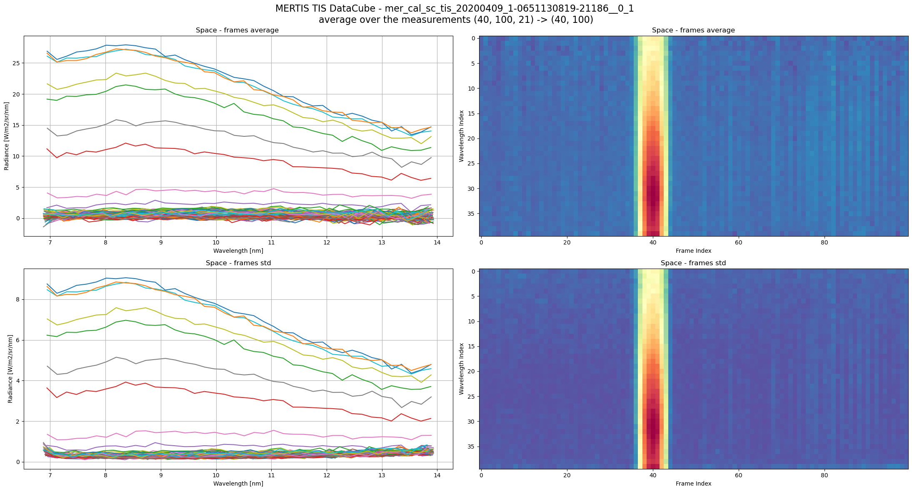
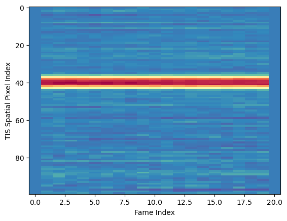
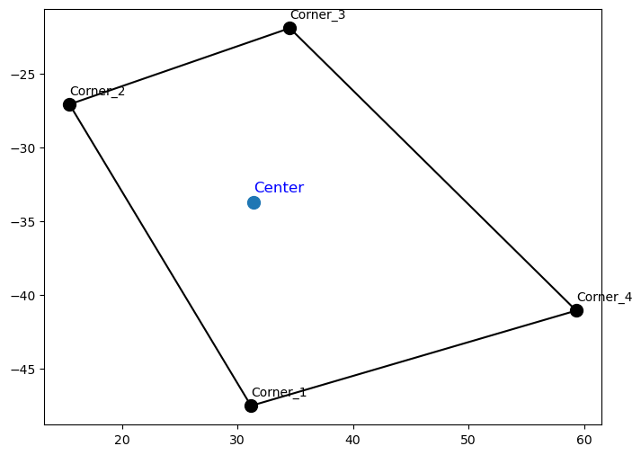

# install


<!-- WARNING: THIS FILE WAS AUTOGENERATED! DO NOT EDIT! -->

## mertisreader - Quick cheatsheet

Import Required Libraries

``` python
import pathlib
import rich
import mertisreader as mr

print("Libraries imported successfully.")
```

    Libraries imported successfully.

### Initialize MERTISDataPackReader

Initialize the MERTISSessionReader with the input directory and optional
parameters for output directory and log level.

The `../data/` contains a subset of the Moon flyby , technically called
Earth Gravity Assist (EGA).

The directory name reflects ESA-PSA/PDS4 naminhc scheme and the start /
stop data acquistion , plus the data pack creation.

Under this, there the different data levels :

| Level | Units           | Geometry | Calibration Targets | TIS Aligned |
|-------|-----------------|----------|---------------------|-------------|
| raw   | Digital Numbers | No       | No                  | No          |
| par   | Physical Units  | Yes      | Yes                 | No          |
| cal   | Physical Units  | Yes      | No                  | Yes         |

- **Calibration Target** : if the currnet level contains calibration
  target measurements or only scientifically relevant one.
- **TIS Aligned:** : the TIS (Thermal Infrared Spectrometer) wavelength
  grid is aligned with the detector’s X and Y axes, so all pixels share
  the same wavelength grid. If not aligned, each pixel has its own
  wavelength grid, making data comparison and analysis more complex.

Just change the level directory, the package can handle all the levels
and read the data, take care of not calling geometry related paramter on
RAW.

``` python
input_path = pathlib.Path('../data/bcmer_tm_all_START-20200409T000000_END-20200410T000000_CRE-20240717T132010-ParamEventBootSciHK-short/cal')
output_path = pathlib.Path('/tmp/')
log_level = 'INFO'

if not input_path.exists():
    print(f"Input path {input_path} does not exist.")
else:
    print(f"Reading path {input_path}")

ms_reader = mr.MERTISDataPackReader(input_dir=input_path, output_dir=output_path, log_level=log_level)

print(f'MERTISDataPackReader initialized with input directory: {ms_reader.input_dir}')
print(f'Output directory: {ms_reader.output_dir}')
print(f'Log level: {ms_reader.log_level}')
```

    2025-10-02 16:44:54,927|452487|INFO|input_dir=PosixPath('../data/bcmer_tm_all_START-20200409T000000_END-20200410T000000_CRE-20240717T132010-ParamEventBootSciHK-short/cal')

    Reading path ../data/bcmer_tm_all_START-20200409T000000_END-20200410T000000_CRE-20240717T132010-ParamEventBootSciHK-short/cal
    MERTISDataPackReader initialized with input directory: ../data/bcmer_tm_all_START-20200409T000000_END-20200410T000000_CRE-20240717T132010-ParamEventBootSciHK-short/cal
    Output directory: /tmp
    Log level: INFO

Show Files in Input Directory

``` python
ms_reader.show_files()
```

    All files in input_dir :

<pre style="white-space:pre;overflow-x:auto;line-height:normal;font-family:Menlo,'DejaVu Sans Mono',consolas,'Courier New',monospace"><span style="color: #800080; text-decoration-color: #800080; font-weight: bold">Counter</span><span style="font-weight: bold">({</span><span style="color: #008000; text-decoration-color: #008000">'.dat'</span>: <span style="color: #008080; text-decoration-color: #008080; font-weight: bold">2</span>, <span style="color: #008000; text-decoration-color: #008000">'.lblx'</span>: <span style="color: #008080; text-decoration-color: #008080; font-weight: bold">3</span>, <span style="color: #008000; text-decoration-color: #008000">'.fits'</span>: <span style="color: #008080; text-decoration-color: #008080; font-weight: bold">1</span><span style="font-weight: bold">})</span>
</pre>

    All files in input_dir matching old pattern <v0.2.6 (\d{8}_\d{8}):

<pre style="white-space:pre;overflow-x:auto;line-height:normal;font-family:Menlo,'DejaVu Sans Mono',consolas,'Courier New',monospace"><span style="color: #800080; text-decoration-color: #800080; font-weight: bold">Counter</span><span style="font-weight: bold">()</span>
</pre>

    All files in input_dir matching new pattern >=v0.2.6 (mer_cal_sc_tis_YYYYMMDD_1-...):

<pre style="white-space:pre;overflow-x:auto;line-height:normal;font-family:Menlo,'DejaVu Sans Mono',consolas,'Courier New',monospace"><span style="color: #800080; text-decoration-color: #800080; font-weight: bold">Counter</span><span style="font-weight: bold">({</span><span style="color: #008000; text-decoration-color: #008000">'mer_cal_sc_tis'</span>: <span style="color: #008080; text-decoration-color: #008080; font-weight: bold">1</span><span style="font-weight: bold">})</span>
</pre>

List File Types

``` python
ms_reader.listfiletypes()
```

<pre style="white-space:pre;overflow-x:auto;line-height:normal;font-family:Menlo,'DejaVu Sans Mono',consolas,'Courier New',monospace"><span style="font-weight: bold">{</span>
    <span style="color: #008000; text-decoration-color: #008000">'hk_default'</span>: <span style="font-weight: bold">[</span><span style="color: #008000; text-decoration-color: #008000">'mer_cal_hk_default_20200409_1-0651130766-12538__0_1.dat'</span><span style="font-weight: bold">]</span>,
    <span style="color: #008000; text-decoration-color: #008000">'hk_extended'</span>: <span style="font-weight: bold">[</span><span style="color: #008000; text-decoration-color: #008000">'mer_cal_hk_extended_20200409_1-0651130766-12595__0_1.dat'</span><span style="font-weight: bold">]</span>,
    <span style="color: #008000; text-decoration-color: #008000">'sc_tis'</span>: <span style="font-weight: bold">[</span><span style="color: #008000; text-decoration-color: #008000">'mer_cal_sc_tis_20200409_1-0651130819-21186__0_1.fits'</span><span style="font-weight: bold">]</span>,
    <span style="color: #008000; text-decoration-color: #008000">'sc_tir'</span>: <span style="font-weight: bold">[]</span>,
    <span style="color: #008000; text-decoration-color: #008000">'sc_tis_ql'</span>: <span style="font-weight: bold">[]</span>,
    <span style="color: #008000; text-decoration-color: #008000">'sc_tir_ql'</span>: <span style="font-weight: bold">[]</span>
<span style="font-weight: bold">}</span>
</pre>

<pre style="white-space:pre;overflow-x:auto;line-height:normal;font-family:Menlo,'DejaVu Sans Mono',consolas,'Courier New',monospace"><span style="font-weight: bold">{</span><span style="color: #008000; text-decoration-color: #008000">'hk_default'</span>: <span style="color: #008080; text-decoration-color: #008080; font-weight: bold">1</span>, <span style="color: #008000; text-decoration-color: #008000">'hk_extended'</span>: <span style="color: #008080; text-decoration-color: #008080; font-weight: bold">1</span>, <span style="color: #008000; text-decoration-color: #008000">'sc_tis'</span>: <span style="color: #008080; text-decoration-color: #008080; font-weight: bold">1</span>, <span style="color: #008000; text-decoration-color: #008000">'sc_tir'</span>: <span style="color: #008080; text-decoration-color: #008080; font-weight: bold">0</span>, <span style="color: #008000; text-decoration-color: #008000">'sc_tis_ql'</span>: <span style="color: #008080; text-decoration-color: #008080; font-weight: bold">0</span>, <span style="color: #008000; text-decoration-color: #008000">'sc_tir_ql'</span>: <span style="color: #008080; text-decoration-color: #008080; font-weight: bold">0</span><span style="font-weight: bold">}</span>
</pre>

Collect Data

``` python
ms_reader.data_collector()

print(f'Collected data keys: {ms_reader.collect_data.keys()}')
for key, value in ms_reader.collect_data.items():
    print(f'{key}: {len(value)} files collected')
```

    Reading filetype: hk_default from mer_cal_hk_default_20200409_1-0651130766-12538__0_1
    Reading filetype: hk_extended from mer_cal_hk_extended_20200409_1-0651130766-12595__0_1
    Reading filetype: tis from mer_cal_sc_tis_20200409_1-0651130819-21186__0_1
    Collected data keys: dict_keys(['hk_default', 'hk_extended', 'tis'])
    hk_default: 1 files collected
    hk_extended: 1 files collected
    tis: 1 files collected

Assemble Data

``` python
ms_reader.data_assembler(verbose=True)
```

    Output()

<pre style="white-space:pre;overflow-x:auto;line-height:normal;font-family:Menlo,'DejaVu Sans Mono',consolas,'Courier New',monospace">Reading filetype: tis from 
../data/bcmer_tm_all_START-20200409T000000_END-20200410T000000_CRE-20240717T132010-ParamEventBootSciHK-short/cal/me
r_cal_sc_tis_20200409_1-0651130819-21186__0_1.fits
</pre>

<pre style="white-space:pre;overflow-x:auto;line-height:normal;font-family:Menlo,'DejaVu Sans Mono',consolas,'Courier New',monospace"></pre>

    n_wav=40 # generic wavelengths : not precise enough for scientific analysis!
    |    | tis_stem                                        |   finite(geo) |   geo.size |
    |---:|:------------------------------------------------|--------------:|-----------:|
    |  0 | mer_cal_sc_tis_20200409_1-0651130819-21186__0_1 |           672 |      10500 |
    Indices of measurements targets (HK_STAT_TIS_DATA_ACQ_TARGET):
    space_index_merged.shape=(21,)
    bb7_index_merged.shape=(0,)
    bb3_index_merged.shape=(0,)
    planet_index_merged.shape=(0,)
    Collected data statistics:
    Number of TIS files: 1
    Number of HK files: 2
    Number of TIR files: 0
    Number of TIS QL files: 0
    Number of TIR QL files: 0

Verify the Assembled Data

``` python
# RAW does not have geometry data
if ms_reader.processing_level != 'RAW':
    print(f'Geometry data keys: {ms_reader.geom_ls.keys()}')
print(f'Frames data keys: {ms_reader.frames.keys()}')
print(f'Wavelengths data keys: {ms_reader.wavelengths.keys()}')
print(f'MERTIS TIS metadata keys: {ms_reader.mertis_tis_metadata.keys()}')
print(f'Space index merged shape: {ms_reader.space_index_merged.shape}')
print(f'BB7 index merged shape: {ms_reader.bb7_index_merged.shape}')
print(f'BB3 index merged shape: {ms_reader.bb3_index_merged.shape}')
print(f'Planet index merged shape: {ms_reader.planet_index_merged.shape}')
```

    Geometry data keys: dict_keys(['mer_cal_sc_tis_20200409_1-0651130819-21186__0_1'])
    Frames data keys: dict_keys(['mer_cal_sc_tis_20200409_1-0651130819-21186__0_1'])
    Wavelengths data keys: dict_keys(['mer_cal_sc_tis_20200409_1-0651130819-21186__0_1'])
    MERTIS TIS metadata keys: dict_keys(['mer_cal_sc_tis_20200409_1-0651130819-21186__0_1'])
    Space index merged shape: (21,)
    BB7 index merged shape: (0,)
    BB3 index merged shape: (0,)
    Planet index merged shape: (0,)

A data directory can contains more file for each type, those are
collected in a dict for each `ms_reader` variable , so it is handy to
define which file we want to work with after inspection, like the
following :

``` python
file_key = list(ms_reader.frames.keys())[0]
print(f'Example DataCube shape for file {file_key}: {ms_reader.frames[file_key].shape}')
```

    Example DataCube shape for file mer_cal_sc_tis_20200409_1-0651130819-21186__0_1: (40, 100, 21)

### Show some data & plots

now, let’s see some (meta)data:

``` python
ms_reader.mertis_tis_metadata[file_key].iloc[0:4].T
```

<div>
<style scoped>
    .dataframe tbody tr th:only-of-type {
        vertical-align: middle;
    }
&#10;    .dataframe tbody tr th {
        vertical-align: top;
    }
&#10;    .dataframe thead th {
        text-align: right;
    }
</style>

|  | 0 | 1 | 2 | 3 |
|----|----|----|----|----|
| TIME_UTC | 2020-04-09T05:40:20.710Z | 2020-04-09T05:40:31.748Z | 2020-04-09T05:40:32.548Z | 2020-04-09T05:40:33.348Z |
| TIME_OBT | 1/0651130819:21186 | 1/0651130830:23689 | 1/0651130831:10567 | 1/0651130831:62998 |
| TimeStamp | 651130823\.044403 | 651130830\.950928 | 651130831\.746674 | 651130832\.544235 |
| HK_STAT_TIS_DATA_ACQ_ID | 3740 | 3743 | 3744 | 3745 |
| HK_STAT_TIS_DATA_ACQ_TYPE | Sci_Raw | Sci_Subtracted_BB3 | Sci_Subtracted_BB3 | Sci_Subtracted_BB3 |
| HK_STAT_TIS_DATA_ACQ_TARGET | Space | Space | Space | Space |
| HK_STAT_BOL_BIAS_VOLT_ACTIVE_PARAM_SET | 2 | 2 | 2 | 2 |
| HK_STAT_TIS_DATA_ACQ_TIME | 651130819\.323273 | 651130830\.361465 | 651130831\.16124 | 651130831\.961273 |
| PAR_TIS_BIN_MODE | 1x2 | 1x2 | 1x2 | 1x2 |
| PAR_TIS_WIN_SIZE | 100x80pixel | 100x80pixel | 100x80pixel | 100x80pixel |
| PAR_TIS_COMP_MODE | lossless | lossless | lossless | lossless |
| HK_STAT_TIS_COMP_VERSION | 1 | 1 | 1 | 1 |
| HK_STAT_TIS_COMP_RICE_K_VALUE | 8 | 8 | 8 | 8 |
| HK_STAT_TIS_COMP_INPUT_LENGTH | 100 | 100 | 100 | 100 |
| HK_STAT_TIS_COMP_NUM_BANDS | 5 | 5 | 5 | 5 |
| HK_STAT_TIS_NUM_OVERSAMP | 0 | 32 | 32 | 32 |
| HK_TEMP_BOL_CHIP | 15.0 | 15.0 | 15.003 | 15.002 |
| DAT_TIS_OFFSET_MACRO_PIXEL | 1 | 2052 | 2052 | 2053 |
| HK_TEMP_BOL_HOUSING | 9.527 | 9.519 | 9.519 | 9.52 |
| HK_TEMP_OST_BASE_PLATE | 9.894 | 9.891 | 9.889 | 9.889 |
| PAR_TIS_DATA_NOISE_REDUCTION | 0 | 0 | 0 | 0 |
| HK_STAT_TIS_TOTAL_PACKET_NUM | 1 | 1 | 1 | 1 |
| HK_STAT_TIS_CURRENT_PACKET_NUM | 1 | 1 | 1 | 1 |
| HK_STAT_TIS_NUM_DATA_WORDS | 384 | 1206 | 1200 | 1208 |

</div>

``` python
from matplotlib import pyplot as plt
import matplotlib.dates as mdates

ax = ms_reader.mertis_tis_metadata[file_key]\
    .set_index('TIME_UTC').loc[:,'HK_STAT_TIS_COMP_VERSION':]\
        .plot(figsize=[10,15], legend=True, title='MERTIS TIS Metadata', grid=True, subplots=True);

ax[-1].xaxis.set_major_formatter(mdates.DateFormatter('%H:%M:%S'))
ax[-1].set_xlabel('TIME_UTC', fontsize=10)
plt.tight_layout()

plt.tight_layout()
```


Now some data from TIS detector, each one a 2D array.

For those data, dufing cruise, the scientific data are collected ueing
the Space port and not Planet port.

TIS Datacube size is the union of several TIS 2D array measurement, each
one typically `(40, 100)` = (`n_spectral`,`n_spatial`), depending on
binning and windowing.

``` python
ms_reader.frames[file_key].shape
```

    (40, 100, 21)

`(40, 100, 21)` = (`n_spectral`,`n_spatial`,`n_frames`)

- `n_spectral` : number of spectral channels, depends on pixel spectral
  binning (1,2,4) result in `n_spatial` == (80,40,20)
- `n_spatial` : number of measurements spatial pixels, depends on pixel
  spatial binning (1,2,4) result in `n_spatial` == (100,50,25)
- `n_frames` : number of TIS frames, or measurements, this correspond to
  the time axis.

``` python
full_frames_3D = ms_reader.frames[file_key]
wav = ms_reader.wavelengths[file_key]
plot_index = ms_reader.space_index[file_key]
print(f'plot_index: {plot_index}')

fig, ax = plt.subplots(ncols=2,nrows=2, figsize = [22,12])

fig.suptitle(f'MERTIS TIS DataCube - {file_key} \n'
             f'average over the measurements {full_frames_3D.shape} -> {full_frames_3D[:,:,0].shape}',
             fontsize=16)
title = 'Space'
ax[0][0].plot(wav,full_frames_3D[:,:,plot_index].mean(axis=2));
ax[0][0].set_title(f'{title} - frames average ')
ax[0][1].imshow(full_frames_3D[:,:,plot_index].mean(axis=2),aspect='auto',cmap=plt.cm.Spectral_r)
ax[0][1].set_title(f'{title} - frames average')

ax[1][0].set_title(f'{title} - frames std')
ax[1][0].plot(wav,full_frames_3D[:,:,plot_index].std(axis=2));
ax[1][1].set_title(f'{title} - frames std')
ax[1][1].imshow(full_frames_3D[:,:,plot_index].std(axis=2),aspect='auto',cmap=plt.cm.Spectral_r)

_ = [a.set_xlabel('Wavelength [nm]') for a in ax[:,0]]
_ = [a.set_ylabel('Radiance [W/m2/sr/nm]') for a in ax[:,0]]
_ = [a.grid(True) for a in ax[:,0]]

_ = [a.set_xlabel('Frame Index') for a in ax[:,1]]
_ = [a.set_ylabel('Wavelength Index') for a in ax[:,1]]

plt.tight_layout()
```

    plot_index: RangeIndex(start=0, stop=21, step=1)



``` python
plt.imshow(full_frames_3D[-1,:,plot_index].T,aspect='auto',cmap=plt.cm.Spectral_r)

plt.xlabel('Fame Index')
plt.ylabel('TIS Spatial Pixel Index')
```

    Text(0, 0.5, 'TIS Spatial Pixel Index')



The higher level pixel near 40 are the “first light” MERTIS ever saw in
space, from the Moon.

Now some geometry data , not available in RAW data.

``` python
rich.print(ms_reader.geom_ls[file_key].keys())
```

<pre style="white-space:pre;overflow-x:auto;line-height:normal;font-family:Menlo,'DejaVu Sans Mono',consolas,'Courier New',monospace"><span style="color: #800080; text-decoration-color: #800080; font-weight: bold">dict_keys</span><span style="font-weight: bold">([</span><span style="color: #008000; text-decoration-color: #008000">'MERTIS_TIS_GEOMETRY_TARGET_LONGITUDE'</span>, <span style="color: #008000; text-decoration-color: #008000">'MERTIS_TIS_GEOMETRY_TARGET_LATITUDE'</span>, 
<span style="color: #008000; text-decoration-color: #008000">'MERTIS_TIS_GEOMETRY_SUBSPACECRAFT_LONGITUDE'</span>, <span style="color: #008000; text-decoration-color: #008000">'MERTIS_TIS_GEOMETRY_SUBSPACECRAFT_LATITUDE'</span>, 
<span style="color: #008000; text-decoration-color: #008000">'MERTIS_TIS_GEOMETRY_SUB_SUN_LONGITUDE'</span>, <span style="color: #008000; text-decoration-color: #008000">'MERTIS_TIS_GEOMETRY_SUB_SUN_LATITUDE'</span>, 
<span style="color: #008000; text-decoration-color: #008000">'MERTIS_TIS_GEOMETRY_TARGET_ALTITUDE'</span>, <span style="color: #008000; text-decoration-color: #008000">'MERTIS_TIS_GEOMETRY_SUBSPACECRAFT_ALTITUDE'</span>, 
<span style="color: #008000; text-decoration-color: #008000">'MERTIS_TIS_GEOMETRY_SUB_SUN_ALTITUDE'</span>, <span style="color: #008000; text-decoration-color: #008000">'MERTIS_TIS_GEOMETRY_TARGET_DISTANCE'</span>, 
<span style="color: #008000; text-decoration-color: #008000">'MERTIS_TIS_GEOMETRY_TARGET_ANGULAR_DIAMETER'</span>, <span style="color: #008000; text-decoration-color: #008000">'MERTIS_TIS_GEOMETRY_LOCAL_TIME'</span>, 
<span style="color: #008000; text-decoration-color: #008000">'MERTIS_TIS_GEOMETRY_TARGET_PHASE_ANGLE'</span>, <span style="color: #008000; text-decoration-color: #008000">'MERTIS_TIS_GEOMETRY_TARGET_EMISSION_ANGLE'</span>, 
<span style="color: #008000; text-decoration-color: #008000">'MERTIS_TIS_GEOMETRY_TARGET_INCIDENCE_ANGLE'</span><span style="font-weight: bold">])</span>
</pre>

``` python
ms_reader.geom_ls[file_key]['MERTIS_TIS_GEOMETRY_TARGET_LONGITUDE'].shape
```

    (5, 100, 21)

The dimension for the geoemtry variables are `(5, 100, 21)` == (corners,
n_spatial, n_frames) :

- **Corners** of each pixel used for SPICE calculation, in order,
  looking from instrument , X axis up = (center, upper left, upper
  right, lower right, lower left)

<!-- -->

    C2       C1
     +-------+
     |       |
     |  C0   |
     |       |
     +-------+
    C3      C4

- `n_spatial` : number of measurements spatial pixels, depends on pixel
  spatial binning (1,2,4) result in `n_spatial` == (100,50,25)
- `n_frames` : number of TIS frames, or measurements, this correspond to
  the time axis in the TIS datacube.

``` python
plt.figure(figsize=(16, 6))
longitudes = ms_reader.geom_ls[file_key]['MERTIS_TIS_GEOMETRY_TARGET_LONGITUDE']
longitudes_center = longitudes[0,:,:]
latitudes = ms_reader.geom_ls[file_key]['MERTIS_TIS_GEOMETRY_TARGET_LATITUDE']
latitudes_center = latitudes[0,:,:]

local_times = ms_reader.geom_ls[file_key]['MERTIS_TIS_GEOMETRY_LOCAL_TIME']
local_times_center = local_times[0,:,:]

sc = plt.scatter(longitudes_center.flatten(), latitudes_center.flatten(), c=local_times_center.flatten(), s=10, cmap='Spectral_r')
plt.xlabel('Longitude')
cbar = plt.colorbar(sc)
cbar.set_label('Local Time')
plt.ylabel('Latitudes')
plt.title('Scatter plot of Target Longitude vs Latitude centers')
plt.grid(True)
plt.show()
```


Let’s find some TIS sptail pixels with defined geometries on all corners

``` python
import numpy as np

arr = latitudes  # shape (5, 100, 21)
not_nan_mask = ~np.isnan(arr)
all_not_nan = np.all(not_nan_mask, axis=0)  # shape (100, 21)
indices = np.argwhere(all_not_nan)  # returns (i, j) pairs where all axis=0 are not nan

print(len(indices))
print(indices[:5])
```

    105
    [[38  0]
     [38  1]
     [38  2]
     [38  3]
     [38  4]]

``` python
plt.figure(figsize=(8, 6))

pixel_index = indices[0]  # Take the first valid pixel for demonstration

# Plot the corners of the polygon
plt.scatter(longitudes[1:,pixel_index[0],pixel_index[1] ], latitudes[1:,pixel_index[0],pixel_index[1] ], s=100, c='black')

# Extract the longitude and latitude for the corners (1:5), close the polygon by repeating the first corner
poly_lons = longitudes[1:, pixel_index[0], pixel_index[1]]
poly_lats = latitudes[1:, pixel_index[0], pixel_index[1]]
# Close the polygon
poly_lons = np.append(poly_lons, poly_lons[0])
poly_lats = np.append(poly_lats, poly_lats[0])

for i in range(1, 5):
    plt.text(
        poly_lons[i-1],
        poly_lats[i-1]+0.5,  # Offset the text slightly above the point
        f'Corner_{i}',
        fontsize=10,
        color='black',
        ha='left',
        va='bottom'
    )

# Plot the connecting lines
plt.plot(poly_lons, poly_lats, linestyle='-', color='black')

plt.scatter(longitudes[0,pixel_index[0],pixel_index[1] ], latitudes[0,pixel_index[0],pixel_index[1] ], s=100)
plt.text(
    longitudes[0, pixel_index[0], pixel_index[1]],
    latitudes[0, pixel_index[0], pixel_index[1]]+0.5,  # Offset the text slightly above the point
    'Center',
    fontsize=12,
    color='blue',
    ha='left',
    va='bottom'
)
```

    Text(31.43904149826383, -33.20697106068339, 'Center')


